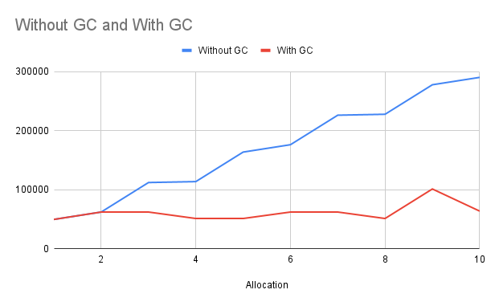

# OS LAB ASSIGN 5 (Group 42)
##### Anurat Bhattacharya (19CS10071)
##### Srijan Das (19CS30046)

## Discussions

- Structure of Internal Page Tage : [Page Table](#struct-sym-entry) 

- Additional Data Strutures and functions:

	- [Free Segment List](#global-data)

	- [Loaded Segment List](#global-data)

	- [mark_and_sweep()](#void-mark-and-sweep)

	- [compact()](#void-compact)

- Impact of mark_and_sweep in demo1 and demo2:
  
  With GC: Avg :62031.5, SD:15060.13842 \
  Without GC: Avg :170313, SD: 85172.15104\
  Time for running GC : 7231 microsecs
- [Logic for running compact](#void-compact)

- Use of Locks : Locks have been used in the garbage collector to lock till 
the current iteration of garbage collection is over.This is done to prevent \
errors in case someone is accessing the memory during this process.Also during compact function \ locks have been used for the same reason.

## Globals ,Data structures and functions used: 

#### class Mem:

	int ind:starting logical address
	int size:number of 4 byte blocks

#### class Node:

	int beg:Begin Logical address block index
	int seq:Sequence number of the variable
	int symind:Symbol table index
	int end:End logical address block index
    Node* nxt:Pointer to the next free block
   	Node* prev:Pointer to the previous free block

#### class Stack:

	int *arr :Memory alocated dynamically
	int top : top index
	int sz : Current size of the stack 

	void push_back(int x) : For adding elements
	int pop_back() : For deleting elements
	int& back() : The last element pushed
	int& operator :Random access Operator
	
#### class Variable:

	int val: Value of the variable
	int type : Type of the variable
	int sz: Size in bits

#### struct sym entry:

	int offset: index in memory segment(that is the block index)
	int flag:Initilized to 0 Used in state rotation while doing mark and sweep
	int isEmpty: 1 for empty
	Variable v:The variable contained in this symbol table
	int isArr:Indicate if current entry is for an array
	int seq:indicattes the sequence number of the variable generated

#### Mem getFirstFit(size_t sz,int sym_ind,int seq):

	Params:

		sz:size of free segment required in bytes
		sym_ind:
		seq:

	Brief:
		To find a free segment of size sz using the first fit method
		return: returns start mem block index

#### void createMem(size_t totalSpace)

	Params:
		totalSpace: Total space in bytes
		Brief: Create a memory using malloc

#### int createVar(int type)

	Params:
		type: type of data ( i.e. int / char / medium int / boolean )
		
	Brief:Create a Var object. Each var object is stored in ablock( 4 bytes ).
	return: The symbol table index

#### void assignVar(int memfd1, int val)

	Params:
		memfd1:The input pointer to logical address space
		val:The value to be assigned	
	Brief:Assign variable at position memfd1 with val

#### void assignVar(int memfd1, int offset,int val)

	Params:
		memfd1:start address of array
		val:The value to be assigned
		offset:index of array
	Brief:Assign to array index

#### int createArr(int type,int size)

	Params:
		type:Type of array elem
		size:Number of elements	

	Brief:
	Create a Arr object. The elements of the array are stored contiguously in the 
	blocks.e.g if there are two elements of medium int type in the array, then the 
	first element occupies first 3 bytes of a block and the second element covers 
	the fourth byte and the first two bytes of some other ( need not be contiguous 
	) 4-byte block.

	return:The memory value location

#### int freeElem(int memfd)

	Params:
		memfd: symbol Table Index

	Brief:Lazily just Remove from Symbol table rest managed by the garbage collector

	return: 1 if success 0 if failure

#### void pop_last()

	Brief:Pops last element created from scope stack

#### int get(int memfd,int i):

	Param:
		memfd : Symbol Table index
		i : Indewx(For use in array)
#### int get(int memfd):

	Param:
		memfd : Symbol Table Index

#### void printList(Node* head):

	Helper Function print a list

#### void clear() 

	Brief: For clearing 

#### void end_session()
		
	Brief: For ending the program(Joins the threads)

	
#### void gc_initialize()
	
	Brief: For initialization fo garbage colector

#### void merge(Node* a,Node* b)
Params:
	
	Brief: For merging 2 nodes if they can be merged

#### void mark and sweep()

	Brief: implementation fo mark and sweep algorithm

	Algorithm: It first scans the stacks and marks in the symbol table .Then it 
	scans the symbol table and calls freeelem for those which are not marked and 
	also unmarks those which have been marked 

#### void gc_run()
	
	Brief: Starts the garbage colector
#### void compact()
	
	Brief: For compaction for all the holes present in O(n) time

	Algorithm Used : A 2 pointers method have been used.We have 2 lists a free 
	Segment list and a loaded Segment List .So we scan over the loaded Segment list
	 and and also maintain an index j initially set to 0.For each loaded segment 
	 list we copy all its blocks and keep on incrementing j.This ensures the loaded
	  segments become contiguous.Then we update the relevant bookeeping data for 
	  each loaded segment (O(1)) and continue.
	
#### void* gc_runner(void* arg)
Params:
	
	Brief: The thread function for garbage collection.It periodically does garbage 
	collection.(O(n))(every 2 sec ) or on Asynchronous calls

	Algorithm Used: We use a 2 pointers approach.
	That is we have 2 pointes one starting at the begiining of the free segment 
	list and one for the loaded segment list.Then we scan over the loaded segment 
	list and also keep incrementing the free poitner as we move the loaded pointer 
	till its before the locaton of the loade dpointer.On encountering segments 
	which are to be freed(Current sequnc number do not match symbol table sequence 
	number or the symbol table entry is empty we do list pointer manipulations and 
	add the loaded list to the free list)

### Global Data

	int varSz[4] : Variable type sizes
	sym_entry *symbolTable: Symbol Table Array dynamically allocated in createmem
	Stack stk: stack of symbpol table indices
	int *basep: starting address of dynamically allocated memory
	Node* listPool: Memory segment from which lists are allocated
	Node* memcnt: Memory Counter for Lists
	int nvar: N1umber of variables declared so far(used for assigning sequence numbers)
	Node* root:for storing free segments
	Node* root2:for storing filled segments
	int n : Numeber of bloacks required
	pthread_mutex_t mutex_lock : Global mutex lock
	Stack freeSym:stack of free symbol table indices(For getting free symbol table index in O(1))
	pthread_t gc_collector: